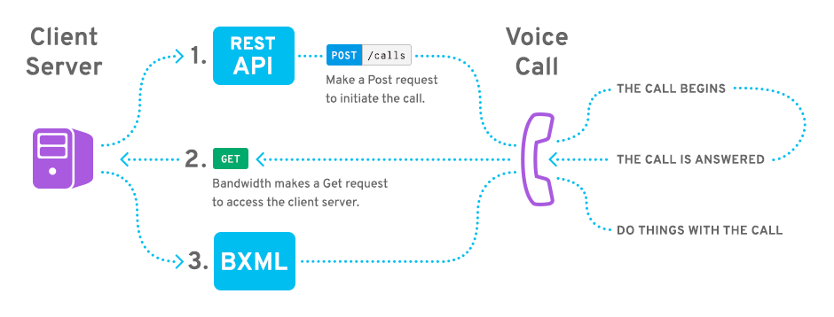

#BXML Basics

##Overview

BXML is a much simpler way to interact with a call. Rather than working with callbacks, BXML handles the call state for you so all you have to implement is the order of events. BXML has many built in features and is perfect for quick development.

##Assumptions

* You have a way to recieve way to recieve webhooks.
* You have downloaded [Postman](http://dev.bandwidth.com/v2-messaging/postman.html) or have another way to make Post requests to the API.
* You have your [Voice and Messaging API](app.bandwidth.com)  userId, token, secret
* You have a Bandwidth phone number.

##About BXML

BXML is completely separate from the Rest API. When using the BXML, the RestAPI can only be used to make calls. Here is an example of a common call flow:


##Setup

For a step by step guide on downloading the software and adding your Bandwidth credentials, visit the [Get Started](http://dev.bandwidth.com/get-started.html)

##Create Call

To create the call, we will use Bandwidth’s Rest API. **THIS IS THE ONLY TIME WE WILL USE THE REST API IN THIS APPLICATION**. Create a call with the to, from, callbackUrl, and callbackHttpMethod parameters. The callbackHttpMethod needs to be set to <code class="get">GET</code> for BXML. The callbackUrl is also important because this is how Bandwidth will notify your program that the call has started and your program can then send the BXML information to the call. For a step by step guide on creating the call, reference the [Get Started Guide](http://dev.bandwidth.com/get-started.html) or for a quick overview, visit the [Outbound Call Building Block](http://dev.bandwidth.com/howto/outboundCall.html).

```
POST https://api.catapult.inetwork.com/v1/users/{userId}/calls
```
```json
{
    to                 : {toNumber},
    from               : {fromNumber},
    callbackUrl        : {callbackUrl},
    callbackHttpMethod : 'GET'
}
```
##Implementing BXML

The call must be active in order to send BXML. BXML has the ability to do the following:

* Play Audio: play a .mp3 or .wav audio file into a call
* Speak Sentence: Speak any sentence into the call
* Gather:  Collects digits from the user. This would be used in a call tree (ex. Press 1 for more options press)
* Record: Record the user. This is often used for voicemail.
* Redirect: Directs the program from one block of code to another.
* Transfer: Transfer call from one number to another.
* Hangup: Ends the call

##Handle Incoming Calls

**Make sure auto answer is on**

To allow the program to answer incoming calls, login to the app.bandwidth.com dashboard. Either create a new application or edit an existing application. The callback request method should be <code class="get">GET</code> and the application type should be set to Voice. Add a callback URL and toggle “Automatically answer incoming calls” to on. Finally, add a Bandwidth phone number to this application. This number will be the number users can call. When the user calls the bandwidth number, the number will answer and notify the callback url that there is an active call. From there, the program acts the same way as create call.


