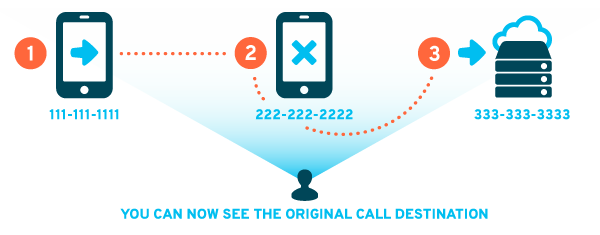

# Information about Inbound SIP Diversion Header - Starting September 19th, 2018

Bandwidth released Diversion Header support to a limited group of accounts on September 19th, 2018. The remainder of our customer-base will receive notice 30-days prior to General Availability (GA).

### WHAT DO I NEED TO KNOW?

Answer Event and Incoming Call Event callbacks will have Diversion header information in them.

### HOW DOES IT LOOK?



In this example, (111) 111-1111 dials (222) 222-2222 and the call is then forwarded to (333) 333-3333.

Incoming Call Event
```
{
  "callId"               : "c-xyz",
  "withholdCallerNumber" : "false",
  "displayName"          : "+11111111111",
  "eventType"            : "incomingcall",
  "callState"            : "active",
  "from"                 : "+11111111111",
  "to"                   : "+13333333333",
  "time"                 : "2018-08-08T14:39:06Z",
  "applicationId"        : "a-xyz",
  "callUri"              : "https://api.catapult.inetwork.com/v1/users/u-xyz/calls/c-xyz",
  "diversion"            : {
    "privacy" : "off",
    "screen"  : "no",
    "reason"  : "unavailable",
    "counter" : 1,
    "Limit"   : 1,
    "origTo"  : "+12222222222"
  }
}
```

Answer Event
```
{
  "callId"               : "c-xyz",
  "withholdCallerNumber" : "false",
  "displayName"          : "+11111111111",
  "eventType"            : "answer",
  "callState"            : "active",
  "from"                 : "+11111111111",
  "to"                   : "+13333333333",
  "time"                 : "2018-08-08T14:39:06Z",
  "callUri"              : "https://api.catapult.inetwork.com/v1/users/u-xyz/calls/c-xyz",
  "diversion"            : {
    "privacy" : "off",
    "screen"  : "no",
    "reason"  : "unavailable",
    "counter" : 1,
    "Limit"   : 1,
    "origTo"  : "+12222222222"
  }
}
```
